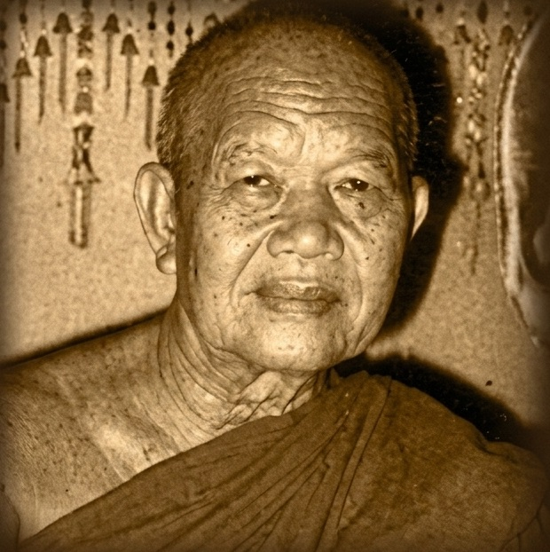

# Ajahn Funn Ācāro Archive

A digital collection dedicated to the teachings of Phra Ajaan Funn Ācāro (1899–1977), a pillar of the Thai Wilderness Tradition known for his profound kindness and strength of character.

---

## Legacy of Stillness

### The Path to the Forest

|  | Originally destined for government service, a young Ajaan Funn’s encounter with the "fleeting and corrupting nature of status" led him instead to the robes. Under the guidance of Ajaan Mun Bhūridatto, he became a master of concentration and a beacon of Dhamma for all of Thailand.  His journey spanned forty years of wandering through the wilds, eventually settling at Wat Paa Udomsomphorn and serving as a spiritual guide to the highest levels of Thai society.  [Read his Biography →](https://meormine.github.io/ajahn-funn/biography.html) |
| --- | --- |

---

> ""When you see all four of these noble truths, that’s when you truly become a monk. If you don’t see them, then no matter how much else you may know, it’s all just book-knowledge. But once you see the four noble truths, you see the Dhamma."
>
> — **Ajahn Funn Ācāro**

---

## Explore the Archive

- [**Biography**](https://meormine.github.io/ajahn-funn/biography.html) — The narrative of his 77 years—from his early disillusionment with power to his final days as a national teacher.
- [**Dhamma Talks**](https://meormine.github.io/ajahn-funn/dhamma_talks.html) — Transcripts and recordings focusing on 'Buddho' meditation and the development of mindfulness in daily life.
- [**Dhamma Quotes**](https://meormine.github.io/ajahn-funn/dhamma_quotes.html) — Short, direct pointers on the nature of the mind and the path to liberation.
- [**Downloads**](https://meormine.github.io/ajahn-funn/download.html) — Access the full audio archive and the mobile application for offline listening.

---

*For the complete experience, visit the [Ajahn Funn Ācāro Archive](https://meormine.github.io/ajahn-funn/).*
